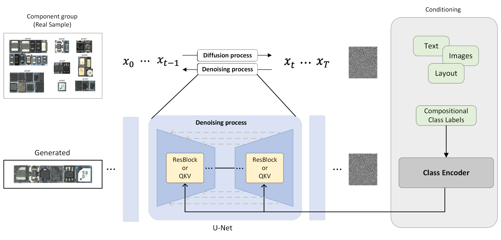

# Compositional Conditional Diffusion Model (CCDM)

CCDM is a diffusion model conditioned on compositional class labels. It learns to generate class features different compositional class labels. The neural network architecture is a U-Net, we implemented four different conditioning modules to compare which is the best for compositional class labels. This code is modified from [this excellent repo](https://github.com/cloneofsimo/minDiffusion) which does unconditional generation. The diffusion model is a [Denoising Diffusion Probabilistic Model (DDPM)](https://arxiv.org/abs/2006.11239).
## Model architecture

The conditioning roughly follows the method described in [Classifier-Free Diffusion Guidance](https://arxiv.org/abs/2207.12598) (also used in [ImageGen](https://arxiv.org/abs/2205.11487)). The model infuses timestep embeddings $t_e$ and context embeddings $c_e$ with the U-Net activations at a certain layer $a_L$, via,

$a_{L+1} = c_e  a_L + t_e.$

(Though in our experimentation, we found variants of this also work, e.g. concatenating embeddings together.)

At training time, $c_e$ is randomly set to zero with probability $0.1$, so the model learns to do unconditional generation (say $\psi(z_t)$ for noise $z_t$ at timestep $t$) and also conditional generation (say $\psi(z_t, c)$ for context $c$). This is important as at generation time, we choose a weight, $w \geq 0$, to guide the model to generate examples with the following equation,

$\hat{\epsilon}_{t} = (1+w)\psi(z_t, c) - w \psi(z_t).$

Increasing $w$ produces images that are more typical but less diverse.

## Dataset
| PCB Dataset | 
| --- |
| |
## Samples generated from CCDM

The images enclosed in red boxes are unseen composition images that were never presented during the training phase.
