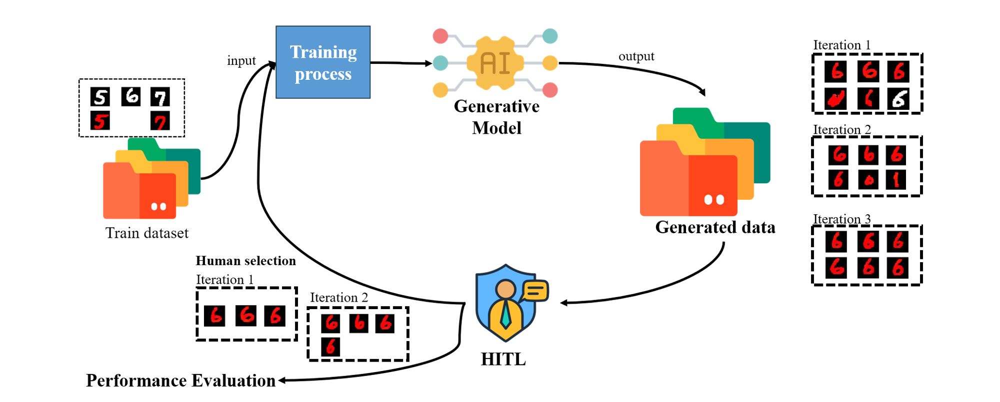

# Iterative Compositional Zero-Shot Generation

This repository is the implementation of **Iterative Compositional Zero-Shot Generation**.

CCDT is only one part of the whole framework. In this project, CCDT is used as the conditional DiT-based generation module for composing two conditions:

- `c1`: attribute condition
- `c2`: object condition

For example:

```text
Good Group1 -> c1 = Good, c2 = Group1
```

## Method Flow

The overall paper pipeline is:

```text
Initial dataset D0
  -> remove the target unseen attribute-object class
  -> split each remaining class into attribute/object conditions
  -> encode images into latent space with Stable Diffusion VAE
  -> train CCDT with compositional conditions c1 and c2
  -> generate candidates for the unseen attribute-object composition
  -> manually select correct, high-quality generated samples
  -> add selected samples back into the training set
  -> retrain or fine-tune with modified balanced sampling
  -> repeat until the final refined model is obtained
```

In short, the paper focuses on **iterative compositional zero-shot generation**, while CCDT is the generation component used inside the framework.

## Iterative Algorithm

The iterative algorithm is a human-in-the-loop retraining loop for generating an unseen attribute-object composition, such as:

```text
Gray_Hair Female
```

The model first learns each semantic factor from seen combinations, then repeatedly improves the missing composition by generating candidates, keeping only correct samples, and retraining with the updated dataset.



## Modified Balanced Sampling

Because the selected generated samples are manually filtered, the updated dataset can become imbalanced. The paper uses a modified balanced sampler to give rare classes more chance to appear during training while avoiding overly aggressive resampling.

For each class `c`, let `N_c` be the number of samples in that class. For a sample `i` from class `c`, its unnormalized probability is:

```text
p_i = 1 / (N_c ^ gamma)
```

The final sampling probability is normalized over all samples:

```text
P_i = p_i / sum_j(p_j)
```

The smoothing parameter `gamma` controls the resampling strength:

```text
gamma = 0       uniform sample-level sampling
0 < gamma < 1   smoother compromise between balance and diversity
gamma = 1       standard balanced sampling, strongest emphasis on rare classes
```

In the paper experiments, different `gamma` values are compared during iterative retraining. The main trade-off is:

```text
higher correctness for the unseen composition
vs.
preserving perceptual diversity among generated samples
```

In the current implementation, `gamma` is set inside `train_modified_balance.py` when creating `BalancedDistributedSampler`:

```python
gamma=0.5
```

Change this value to any value between `0` and `1`:

```text
0 <= gamma <= 1
```

For example, the paper compares settings such as:

```text
gamma = 0
gamma = 0.3
gamma = 0.5
gamma = 0.7
gamma = 1
```

## Practical Iterative Workflow

This repository provides the main CCDT training and sampling components. The full iterative loop is orchestrated by repeatedly preparing datasets, training, generating, and filtering samples.

1. Prepare `D0` by excluding the target unseen class.
2. Train the initial CCDT model with `train_modified_balance.py`.
3. Generate candidate images for the target condition with `sample.py`.
4. Manually inspect generated images and keep only correct samples.
5. Add the selected samples into the target class folder of the next dataset version.
6. Retrain or fine-tune the model on the updated dataset with `train_modified_balance.py`.
7. Repeat the generation, selection, merge, and retraining process for the desired number of iterations.

For example, the dataset versions can be organized as:

```text
CelebA_itr1/   # D0, target unseen class removed
CelebA_itr2/   # D1 + manually selected samples from iteration 1
CelebA_itr3/   # D2 + manually selected samples from iteration 2
```

The `train_modified_balance.py` script trains the compositional DiT model with the paper's modified balanced sampler. It computes sampling probabilities from class frequencies as described above and uses the `gamma` value set in the sampler configuration.

## Dataset Format

The dataset folder should use class names in the format:

```text
<attribute> <object>
```

Example:

```text
Phison/
  Good Group1/
    xxx.jpg
  Good Group2/
    xxx.jpg
  Shift Group1/
    xxx.jpg
  Shift Group2/
    xxx.jpg
```

`dataset.py` reads the folder name and splits it into `attribute` and `object`.
The corresponding label mappings are defined in `config.py`.

## Train

Example:

```bash
torchrun --nnodes=1 --nproc_per_node=2 train_modified_balance.py \
  --data_path /path/to/dataset \
  --model DiT-XL/2 \
  --image-size 128 \
  --num_condition 4 2
```

`--num_condition` means:

```text
<number_of_attributes> <number_of_objects>
```

For example:

```bash
--num_condition 4 2   # 4 attributes, 2 objects
--num_condition 2 7   # 2 attributes, 7 objects
```

Checkpoints are saved in:

```text
results/<experiment-name>/checkpoints/
```

## Generate

Example:

```bash
python sample.py \
  --model DiT-XL/2 \
  --image-size 128 \
  --num_condition 4 2 \
  --ckpt /path/to/checkpoint.pt
```

The sampled condition indices are currently set inside `sample.py`:

```python
c1 = [1]
c2 = [2]
```

Change `c1` and `c2` to generate different attribute-object compositions.

## Files

```text
models.py                  # DiT / CCDT model
train_modified_balance.py  # training script with modified balanced sampling
sample.py                  # generation script
dataset.py                 # dataset loader
config.py                  # attribute/object label mappings
Classifier/                # classifier-based evaluation utilities
LPIPS/                     # perceptual diversity evaluation
diffusion/                 # diffusion utilities
```
