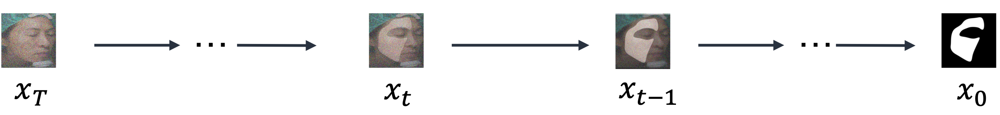
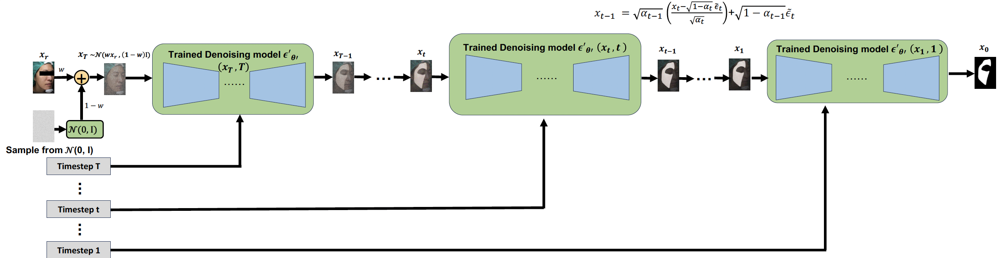

# Modulated Prior Diffusion (MPD)

MPD is a diffusion model that injects condition information by modulating the prior distribution, rather than using conditioning modules inside the network.  It learns to generate segmentation results by initializing the reverse process from noise that contains information from the reference image, instead of starting from pure Gaussian noise.  The neural network architecture is based on U-Net, while the conditioning mechanism is simplified by removing additional encoders or feature fusion modules.  The diffusion process follows the standard [Denoising Diffusion Probabilistic Model (DDPM)](https://arxiv.org/abs/2006.11239).  This implementation is modified from an existing [conditional diffusion repository](https://github.com/machingwen/a3ilab/tree/main/Projects/Compositional%20Conditional%20Diffusion%20Model), and extended to support the Modulated Prior Diffusion (MPD) framework.

## Key Idea

- The reverse process is initialized from a modulated prior whose mean is shifted toward the reference image:

$$
x_T \sim \mathcal{N}(x_r, I)
$$

- The reverse denoising process starts from a noisy sample that already contains conditioning information.

## Model Architecture

The initial noise is combined with the reference image to form a modulated prior, which serves as the starting point of the reverse denoising process.

## Condition Strength Parameter

MPD introduces a condition strength parameter \( w \), which controls how much the reference image influences the prior distribution.

The sampling of the initial noise is modified as:

$$
x_T \sim \mathcal{N}(w x_r, (1 - w) I)
$$

- Larger \( w \): stronger influence from the reference image  
- Smaller \( w \): stronger influence from noise

## Training & Inference

The training and inference procedures follow the standard diffusion framework.

The key difference lies in the initial distribution. Instead of using a standard Gaussian distribution, MPD uses a modulated distribution that incorporates information from the reference image.

  

  

