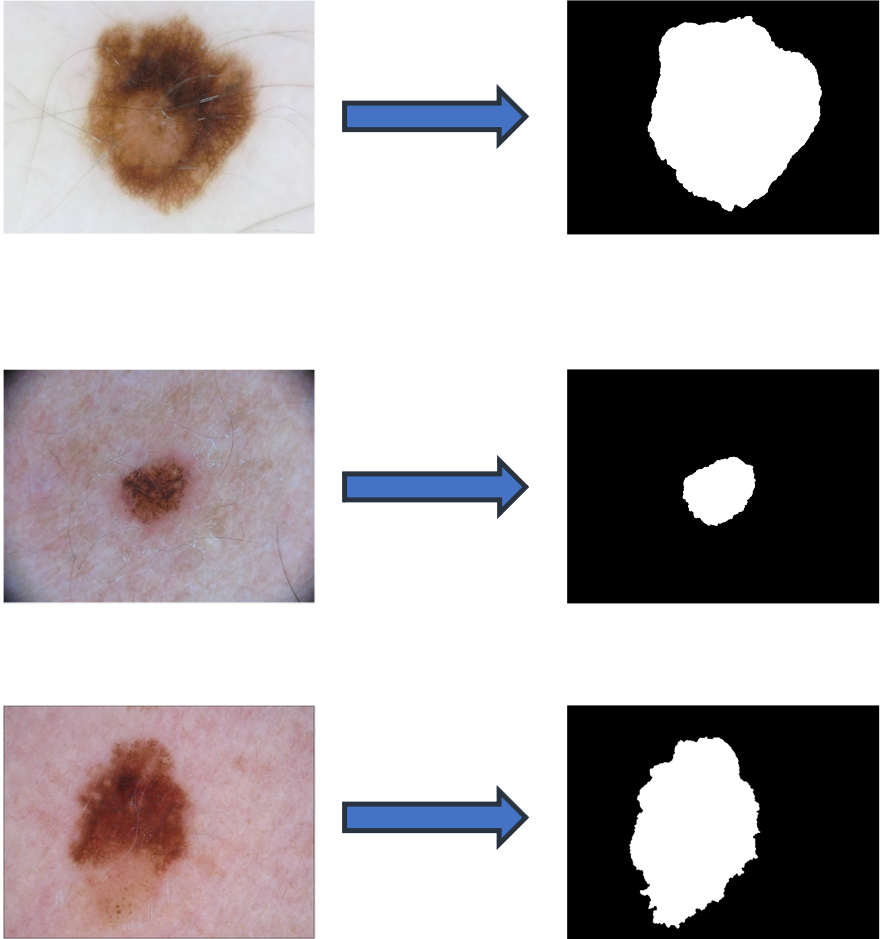
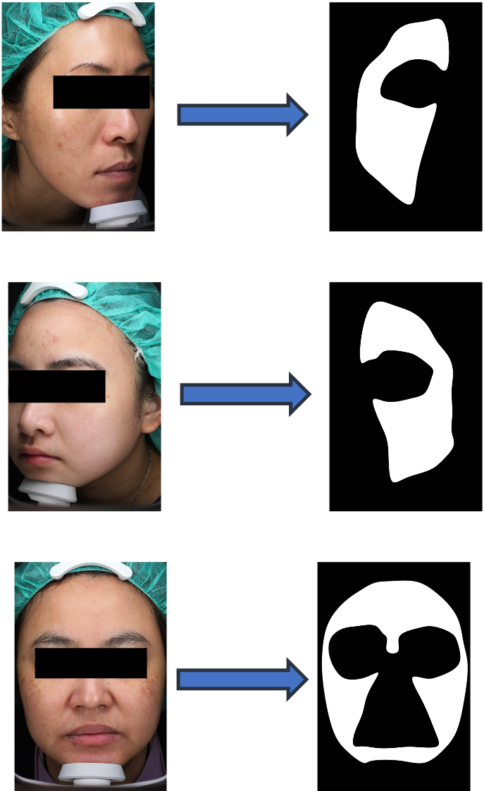

# Modulated Prior Diffusion (MPD)

MPD is a diffusion model that injects condition information by modulating the prior distribution, rather than using conditioning modules inside the network.  It learns to generate segmentation results by initializing the reverse process from noise that contains information from the reference image, instead of starting from pure Gaussian noise.  The neural network architecture is based on U-Net, while the conditioning mechanism is simplified by removing additional encoders or feature fusion modules.  The diffusion process follows the standard [Denoising Diffusion Probabilistic Model (DDPM)](https://arxiv.org/abs/2006.11239).  This implementation is modified from an existing [conditional diffusion repository](https://github.com/machingwen/a3ilab/tree/main/Projects/Compositional%20Conditional%20Diffusion%20Model), and extended to support the Modulated Prior Diffusion (MPD) framework.

## Key Idea

- The reverse process is initialized from a modulated prior whose mean is shifted toward the reference image:

$$
x_T \sim \mathcal{N}(x_r, I)
$$

- The reverse denoising process starts from a noisy sample that already contains conditioning information.

<p align="center">

</p>

## Model Architecture
<p align="center">

</p>

The initial noise is combined with the reference image to form a modulated prior, which serves as the starting point of the reverse denoising process.

## Condition Strength Parameter

MPD introduces a condition strength parameter \( w \), which controls how much the reference image influences the prior distribution.

The sampling of the initial noise is modified as:

$$
x_T \sim \mathcal{N}(w x_r, (1 - w) I)
$$

- Larger \( w \): stronger influence from the reference image  
- Smaller \( w \): stronger influence from noise

## Training & Inference

The training and inference procedures follow the standard diffusion framework.

The key difference lies in the initial distribution. Instead of using a standard Gaussian distribution, MPD uses a modulated distribution that incorporates information from the reference image.

<p align="center">
  <b>Training</b><br>
  
</p>

<p align="center">
  <b>Inference</b><br>
  
</p>

## Dataset

We evaluate our method on medical image segmentation datasets.

- **ISIC dataset**: a public dataset for skin lesion segmentation  
- **KMU dataset**: clinical facial image dataset  

All images are resized to a fixed resolution (e.g., 128 × 128) for training and evaluation.
Below are example images and their corresponding segmentation masks from the datasets.

<div align="center">
  <table>
    <tr>
      <td align="center" valign="middle">
        <b>ISIC</b><br><br>
        
      </td>
      <td align="center" valign="middle">
        <b>KMU</b><br><br>
        
      </td>
    </tr>
  </table>
</div>


## Usage

### Training

Quick server smoke test without a dataset or checkpoint:

```bash
python train_main.py \
  --smoke_test \
  --method mpd \
  --no_wandb \
  --epochs 1 \
  --batch_size 1 \
  --num_workers 0 \
  --img_size 16 \
  --eval_interval 999999 \
  --num_timestep 10 \
  --steps 2 \
  --emb_size 32 \
  --channel_mult 1 \
  --num_res_blocks 1 \
  --num_heads 4 \
  --projection_dim 64 \
  --num_condition 1 1
```

```bash
python train_main.py \
  --smoke_test \
  --method gpcd_concat \
  --no_wandb \
  --epochs 1 \
  --batch_size 1 \
  --num_workers 0 \
  --img_size 16 \
  --eval_interval 999999 \
  --num_timestep 10 \
  --steps 2 \
  --emb_size 32 \
  --channel_mult 1 \
  --num_res_blocks 1 \
  --num_heads 4 \
  --projection_dim 64 \
  --num_condition 1 1
```

Run the following command to start MPD training:

```bash
python train_main.py \
  --method mpd \
  --train_data_root /path/to/split_ISIC \
  --eval_data_root /path/to/split_ISIC \
  --no_wandb
```

You can modify the training settings by adjusting the arguments in the script, such as `--epochs`, `--img_size`, `--batch_size`, and `--lr`.

Example:

```bash
python train_main.py \
  --method mpd \
  --train_data_root /path/to/split_ISIC \
  --eval_data_root /path/to/split_ISIC \
  --no_wandb \
  --epochs 500 \
  --img_size 128 \
  --batch_size 4 \
  --lr 5e-6
```

To train the GPCD concat-downsizer baseline:

```bash
python train_main.py \
  --method gpcd_concat \
  --train_data_root /path/to/split_ISIC \
  --eval_data_root /path/to/split_ISIC \
  --no_wandb \
  --epochs 500 \
  --img_size 128 \
  --batch_size 4 \
  --lr 5e-6
```

The `gpcd_concat` baseline keeps the U-Net denoiser backbone size unchanged. It samples Gaussian training noise, initializes inference from Gaussian noise, concatenates `x_t` with the reference image, and maps the concatenated tensor back to the denoiser input channels with `Conv3x3 + SiLU + Conv1x1`.

---

### Inference

Quick server smoke test without a dataset or checkpoint:

```bash
python generate_main.py \
  --smoke_test \
  --method mpd \
  --steps 2 \
  --smoke_samples 1 \
  --img_size 16 \
  --num_timestep 10 \
  --emb_size 32 \
  --channel_mult 1 \
  --num_res_blocks 1 \
  --num_heads 4 \
  --projection_dim 64
```

```bash
python generate_main.py \
  --smoke_test \
  --method gpcd_concat \
  --steps 2 \
  --smoke_samples 1 \
  --img_size 16 \
  --num_timestep 10 \
  --emb_size 32 \
  --channel_mult 1 \
  --num_res_blocks 1 \
  --num_heads 4 \
  --projection_dim 64
```

Run the following command to perform MPD inference:

```bash
python generate_main.py \
  --method mpd \
  --data_root /path/to/split_ISIC \
  --checkpoint_root /path/to/checkpoint/MED_pth_w_ISIC \
  --output_dir /path/to/generate_result \
  --epoch 500 \
  --ckpt_lr 5.0e-06
```

To run inference with the GPCD concat-downsizer baseline:

```bash
python generate_main.py \
  --method gpcd_concat \
  --data_root /path/to/split_ISIC \
  --checkpoint_root /path/to/checkpoint/MED_pth_w_ISIC \
  --output_dir /path/to/generate_result \
  --epoch 500 \
  --ckpt_lr 5.0e-06
```

After inference, it is recommended to apply post-processing to the generated segmentation results depending on the dataset.

For example, techniques such as smoothing or CRF can be used to refine the segmentation masks.

---
### Notes

Ensure the dataset path is correctly configured before running the code.
