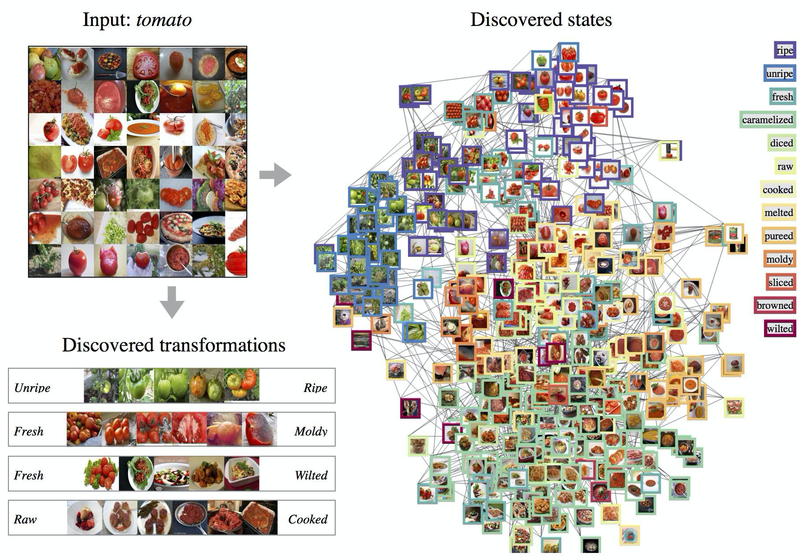
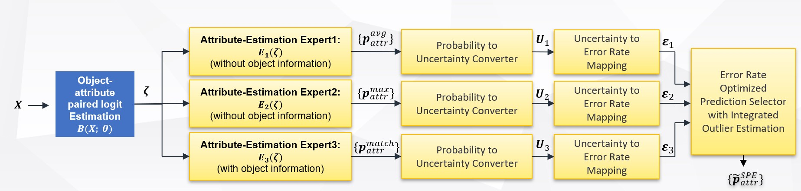
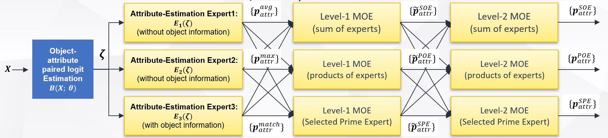

# Selected Prime Expert(SPE)

We present our code on CZSL Dataset and Ensemble Learning Dataset in two folder. Please go into the links below for more information.

## Dataset

[**CZSL Dataset**](https://github.com/SerenityOuO/Selection-of-Predictions-SoP/tree/main/DFSP_project) |  [**Ensemble Learning Dataset**](https://github.com/SerenityOuO/Selection-of-Predictions-SoP/tree/main/test-ensemble-learning)
:-------------------------:|:-------------------------:
 |  

## Abstract
As machine learning technologies proliferate across various industries, scholars and experts continually seek methods to enhance prediction accuracy. Ensemble learning, a proven strategy, can effectively improve the predictive performance of models. The core idea is that the combined predictions of multiple models often surpass the capabilities of a single model. This research primarily focuses on: how to correctly integrate these models' predictions, especially considering the performance of each expert under different scenarios or data.

This study introduces a new strategy: by mapping and analyzing the uncertainty and error rates of each model, a mapping table of uncertainty and error rates is constructed. Through each model's mapping table, we can more precisely identify which experts have greater confidence and accuracy under specific circumstances. This not only assists us in selecting and integrating the most confident predictions but also further enhances the overall predictive efficacy.

This research conducts simulations on real datasets of Compositional Zero-Shot Learning(CZSL) and Ensemble Learning to verify how our method improves performance on these datasets.

## Model architecture

-  SPE :

-  HMOE :

