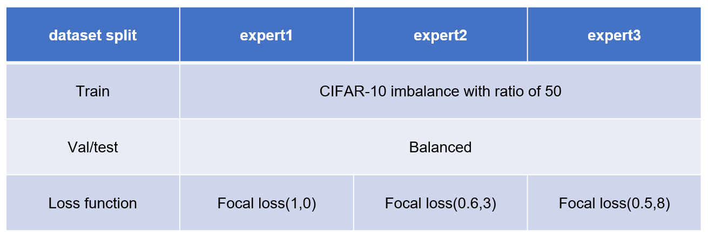
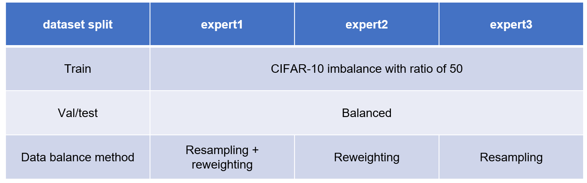
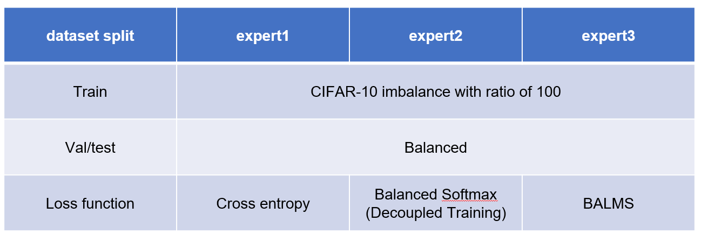

# test-ensemble-learning
 test-ensemble-learning

The `BALMS_test`, `reweight_resample`, and `test_cifar10_focal` directories respectively showcase my Statement of Purpose (SoP) research on addressing imbalance in the CIFAR-10 dataset.

Here are the settings for each folder.

-`test_cifar10_focal`

-`reweight_resample`

-`BALMS_test`
