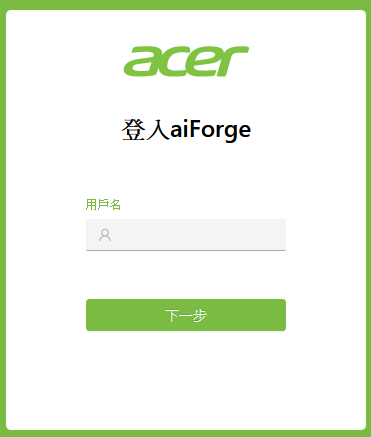
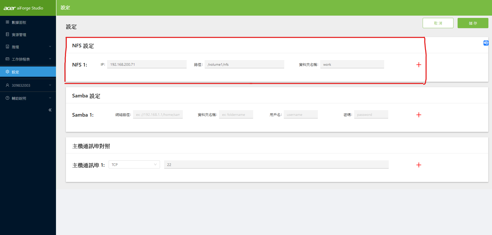
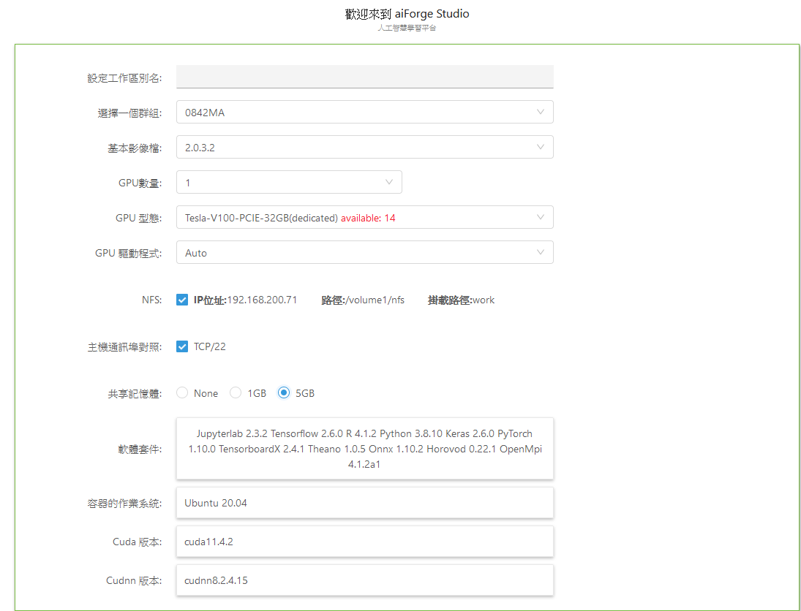

# aiForge Usage

## 登入步驟

aiForge 網站: "https://ai.acer-ast.com:32000/portal2/main/index"

登入帳號密碼為，陽明交通大學的單一入口帳號密碼

 

## NFS 設定

進入設定頁面，將NFS設定按照途中內容進行輸入儲存設定後須 Release

 

## 相關設定

在資源管理，可以設定動態磁碟，將可用空間使用到100GB

需要Release的時候，點擊右上方釋放按鈕

 

## aiForge 設定

Release 後 將NFS選項打勾，設定完成即可開始使用。

 

詳細介紹可查看介紹文件
[**文件**](https://github.com/machingwen/a3ilab/tree/main/aiForge%20Usage/pdf)